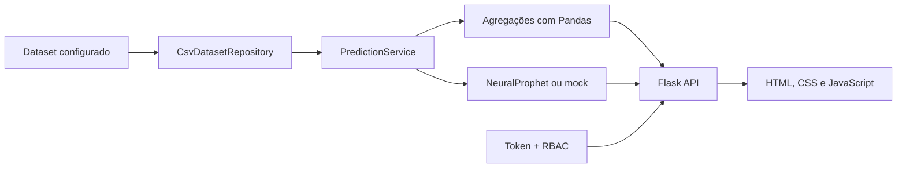

# SafeOps AI

Painel para análise histórica e previsão de volume de eventos de risco em operações logísticas, com backend Flask, autenticação por papel e dashboard web.

> O repositório permanece `IA_Previsao_de_acidentes`. **SafeOps AI** é a identidade editorial recomendada; nenhuma renomeação remota foi realizada.

## Dados publicados

Os únicos datasets publicados na árvore atual são **integralmente sintéticos**. Eles foram gerados por regras determinísticas, não foram derivados linha a linha de pessoas ou operações reais e não contêm nomes, CPF, placas, endereços ou coordenadas.

- `data/synthetic_safety_events.csv`: 30 registros fictícios, com datas e categorias de demonstração
- `data/synthetic_dismissed_drivers.csv`: identificador artificial usado para testar o filtro
- `scripts/generate_synthetic_data.py`: gerador reproduzível desses dois arquivos

Os rótulos `CONDUTOR-SINTETICO-*`, `ZONA-DEMO-*` e `*-DEMO` deixam explícito que nenhum registro representa uma pessoa, veículo ou local real. Bases operacionais devem permanecer fora do Git em `data/private/` ou `data/raw/` e só podem ser usadas após autorização e saneamento apropriados.

## Problema

Equipes de segurança precisam consolidar ocorrências históricas, identificar concentrações por período e categoria e estimar a carga esperada de eventos futuros. A leitura deve separar claramente histórico, previsão e dados de demonstração.

## Solução implementada

O backend carrega eventos de um arquivo CSV, normaliza o conjunto, produz agregações e gera previsão diária. A API retorna totais, rankings, hotspots e um resumo de risco consumido por um dashboard estático.



## O que é real, mock e apresentação

### Backend real

- aplicação Flask organizada em configuração, autenticação, modelos, repositórios, serviços e rotas
- endpoint protegido de previsão por data
- health check com estado do dataset e modo do preditor
- autenticação por token e perfis `admin`, `gestor` e `analista`
- leitura e agregação de CSV com Pandas

### Modelo configurável

- `APP_PREDICTOR_MODE=neuralprophet` treina e reutiliza um `NeuralProphet` sobre a série diária agregada
- `APP_PREDICTOR_MODE=mock` usa média móvel e tendência simples, destinado a testes e desenvolvimento

O projeto não publica métricas de acurácia nem afirma validação estatística em produção. Rankings por motorista, localidade e tipo de evento derivam das proporções históricas; não são modelos independentes de probabilidade causal.

### Dados

- `APP_DATA_FILE` usa por padrão `data/synthetic_safety_events.csv`
- `APP_DISMISSED_DRIVERS_FILE` usa por padrão `data/synthetic_dismissed_drivers.csv`
- ambos os arquivos podem ser recriados de modo idêntico pelo gerador versionado

### Dashboard e modo demo

O frontend é estático, feito com HTML, CSS e JavaScript. O parâmetro `?demo=1` permite apresentação visual com um payload integralmente sintético no navegador. Esse modo não comprova funcionamento do modelo NeuralProphet.

## Screenshots

Os screenshots antigos foram removidos porque reproduziam conteúdo do conjunto operacional anterior. Novas imagens podem ser geradas somente a partir do payload sintético atual:

```powershell
.\scripts\capture_dashboard.ps1
```

## Stack implementada

- Python 3.11
- Flask, Flask-Cors e Gunicorn
- Pandas e NumPy
- NeuralProphet, PyTorch e dependências de forecasting
- HTML, CSS e JavaScript
- Docker
- Pytest e Ruff
- GitHub Actions

## Estrutura

```text
.
├── app_previsao.py
├── radar_preventivo/
│   ├── auth/
│   ├── models/
│   ├── repositories/
│   ├── routes/
│   └── services/
├── tests/
├── data/                 # datasets pequenos e integralmente sintéticos
├── scripts/              # gerador e captura segura da demonstração
├── docs/screenshots/
├── index.html
├── script.js
└── style.css
```

## API

| Método e rota | Finalidade |
| --- | --- |
| `GET /health` | estado da aplicação, dataset e preditor |
| `POST /auth/login` | autenticação |
| `GET /auth/me` | sessão atual |
| `GET /auth/users` | diretório protegido, somente `admin` |
| `GET /predict?date=YYYY-MM-DD` | previsão e leitura analítica, autenticado |

## Configuração

| Variável | Finalidade |
| --- | --- |
| `APP_DATA_FILE` | caminho do CSV sintético; default `data/synthetic_safety_events.csv` |
| `APP_DISMISSED_DRIVERS_FILE` | filtro sintético; default `data/synthetic_dismissed_drivers.csv` |
| `APP_AUTH_USERS_FILE` | arquivo local de usuários com hashes |
| `APP_ALLOW_DEMO_USERS` | habilita usuários de demonstração; default `false` |
| `APP_PREDICTOR_MODE` | `neuralprophet` ou `mock` |
| `APP_SECRET_KEY` | segredo estável para assinatura de tokens |
| `APP_TOKEN_TTL_SECONDS` | duração da sessão |
| `APP_CORS_ORIGINS` | origens permitidas |
| `FORECAST_DAYS` | horizonte de previsão |
| `RECENT_HISTORY_DAYS` | janela histórica recente |

Usuários reais devem ficar em `auth_users.json`, já ignorado pelo Git. As credenciais demonstrativas existentes no código só são carregadas quando `APP_ALLOW_DEMO_USERS=true`; esse modo deve permanecer desabilitado fora de desenvolvimento.

## Como executar localmente

O projeto inicia com o dataset sintético versionado. Para regenerá-lo de forma determinística:

```bash
python scripts/generate_synthetic_data.py
```

```bash
python -m venv .venv
source .venv/bin/activate
pip install -r requirements-dev.txt
python app_previsao.py
```

No PowerShell:

```powershell
python -m venv .venv
.venv\Scripts\Activate.ps1
pip install -r requirements-dev.txt
python .\app_previsao.py
```

Abra `index.html` para usar o dashboard.

## Testes e CI

```bash
ruff check .
pytest
```

Os testes usam `predictor_mode=mock` e fixtures temporárias, evitando treinar NeuralProphet. O workflow executa lint e smoke tests; hooks de deploy só são acionados quando os secrets correspondentes existem no GitHub.

## Segurança e privacidade

- demo users vêm desabilitados por padrão
- arquivo real de usuários não é versionado
- a chave de sessão é gerada em runtime quando não configurada; deploys devem fornecer uma chave externa estável
- CORS deve ser restrito no ambiente implantado
- dados pessoais devem seguir minimização, finalidade, retenção e controle de acesso
- a árvore pública usa somente dados sintéticos; dados operacionais são explicitamente ignorados

## Limitações

- não há métricas versionadas de qualidade do modelo
- o mock valida o contrato e o fluxo, não a acurácia do NeuralProphet
- armazenamento de usuários em JSON é adequado apenas ao escopo atual
- revogação server-side de tokens não foi implementada
- o frontend persiste a sessão no navegador
- a remoção da versão antiga dos dados do histórico Git permanece pendente de autorização específica

## Autor

Renato Boranga
